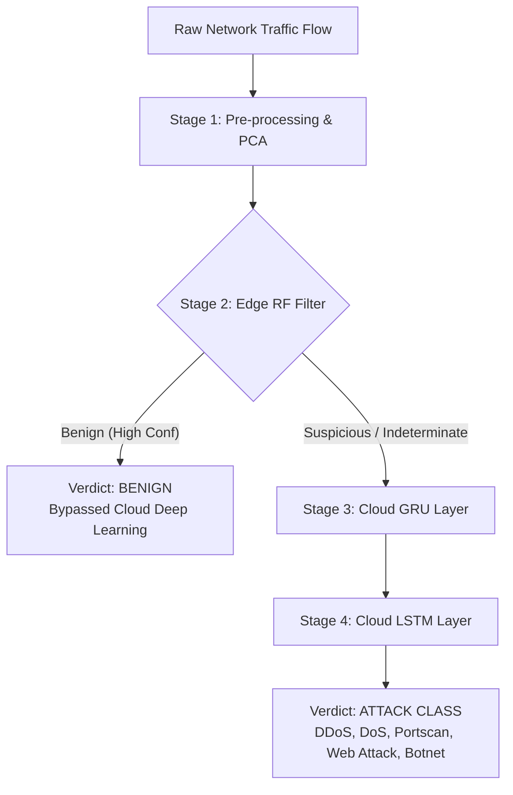

# Hybrid Intrusion Detection System — CICIDS-2017 Dashboard

A modern, high-fidelity research showcase dashboard for the published paper **"A Hybrid Deep Learning Approach for Intelligent Intrusion Detection"**. 

This repository implements the visual presentation, benchmarking metrics, and a client-side **Intrusion Detection Sandbox** simulating the hybrid **Random Forest → GRU → LSTM** cascaded edge-cloud architecture trained on the CICIDS-2017 network traffic dataset.

🌐 **Deployment Link:** [https://Katch-me.github.io/Hybrid-Intrusion-Detection-System-using-CICIDS-2017-Dataset/](https://Katch-me.github.io/Hybrid-Intrusion-Detection-System-using-CICIDS-2017-Dataset/)

---

## 🛰️ Research Context & Architecture

Traditional Intrusion Detection Systems (IDS) struggle to scale under high traffic volume while retaining the memory required to catch slow, sequential, and highly-disguised attacks. This research implements a **two-stage edge-cloud cascading pipeline**:



1. **Stage 1 — Pre-processing & PCA:** StandardScaler standardizes flow metrics, followed by Principal Component Analysis (PCA) projecting inputs into a reduced feature space containing **95% variance** to compress computational footprint.
2. **Stage 2 — Edge Random Forest Filter:** Evaluated locally at the network edge. Clear, high-confidence benign traffic is classified and cleared instantly, **bypassing the cloud stage (saving 100% cloud bandwidth and 92%+ sequence computation)**.
3. **Stage 3 — Cloud GRU (Short-Range Temporal):** Suspicious packets are escalated to the cloud and reshaped into timesteps. The Gated Recurrent Unit (GRU) models short-range recurrent dependencies.
4. **Stage 4 — Cloud LSTM (Long-Range Refinement):** A Long Short-Term Memory (LSTM) layer monitors longer cell state memories, refining the GRU's classification to detect slow-rate or highly spaced-out sequential intrusions.

---

## ⚡ Interactive Testing Sandbox

To demonstrate model behavior without misleading portfolio reviewers with live backend server endpoints, this dashboard integrates a **high-fidelity client-side detection engine** (`src/utils/detector.ts`):

- **Preset Profiles:** Select from 7 standard network scenarios, including *DDoS SYN Flood*, *Slowloris DoS*, *SYN Port Sweep*, *SSH Brute Force*, *SQL Injection (Web Attack)*, *IRC Botnet Heartbeat*, and *Normal Browsing (Benign)*.
- **Manual Adjustments:** Finetune sliders and numbers representing 10 primary network logging metrics (Destination Port, Flow Duration, Forward/Backward Packet counts, IAT Mean, and average Packet Sizes).
- **Custom CSV Upload:** Upload custom network trace logs (`.csv` format). The engine parses inputs in the browser, sweeps rows, classifies packets, and renders a report detailing benign/malicious counts, average latency, and cloud bypass rates.
- **Step-by-step Telemetry Trail:** Watch the packet traverse the pipeline and read logging trails detailing the logical criteria met at each stage.

---

## 🛠️ Technology Stack

- **Framework:** Vite + React + TypeScript
- **Styling:** Tailwind CSS v3
- **Theme:** Network Operations Center (NOC) Dark Theme
- **Fonts:** Space Grotesk (Headers), Inter (Body), IBM Plex Mono (Telemetry / Logs)
- **Deployment:** GitHub Pages
- **CI/CD:** GitHub Actions Workflow

---

## 🚀 Local Development

Follow these steps to run the project locally on your machine.

### Prerequisites
Make sure you have Node.js (v18+) and `pnpm` (or npm/yarn) installed.

### 1. Install dependencies
```bash
pnpm install
```

### 2. Run local dev server
```bash
pnpm run dev
```
Open [http://localhost:5173](http://localhost:5173) in your browser to view the dashboard.

### 3. Build for production
To compile TypeScript and bundle assets:
```bash
pnpm run build
```

---

## 📦 Deployment Configuration

This project is configured to deploy automatically using GitHub Actions.

1. **Vite Base Path:** Configured in `vite.config.ts` to map to the repository name `/Hybrid-Intrusion-Detection-System-using-CICIDS-2017-Dataset/`.
2. **GitHub Actions Workflow:** The workflow file `.github/workflows/deploy.yml` triggers on every push to the `main` branch. It:
   - Sets up Node.js and installs dependencies via `pnpm`.
   - Runs `pnpm run build` to generate the production-ready `dist` folder.
   - Deploys the built assets to the `gh-pages` branch.

To make the site go live:
1. Push this codebase to your GitHub repository `Katch-me/Hybrid-Intrusion-Detection-System-using-CICIDS-2017-Dataset` on the `main` branch.
2. In your GitHub Repository settings, go to **Settings > Pages** and ensure **Build and deployment > Source** is set to **Deploy from a branch**, with the branch set to `gh-pages` (`/root`).

---

## 📑 Authors & Publication Credits

- **Lead Implementation:** Vasava Khushi (Nirma University, India).
- **Co-authors & Contributors:** Vekariya Poojal, Patel Yug, Patel Vraj.
- **Publication Venue:** Presented at the *7th International Conference on Intelligent Autonomous Systems (ICIAS)*.
- **Resources:** Download links for the conference paper PDF and presentation slides are available in the dashboard footer.
